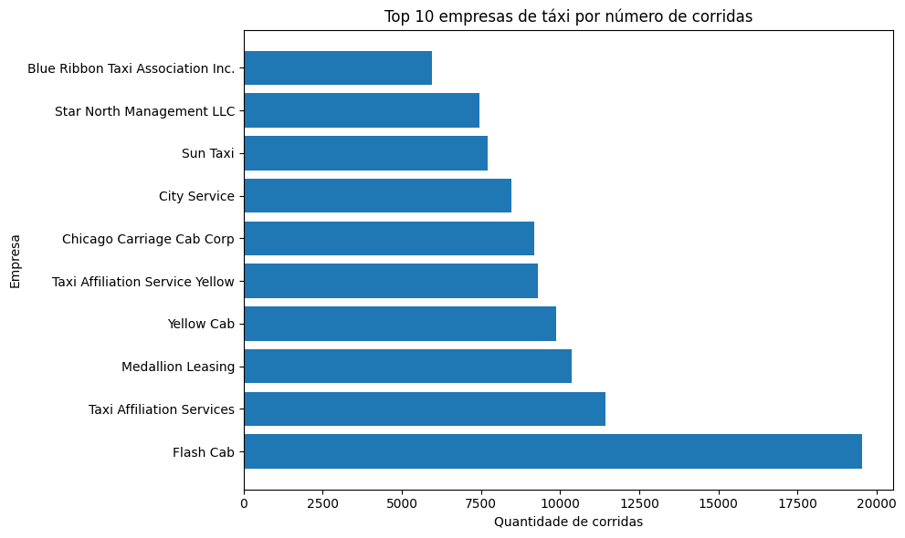
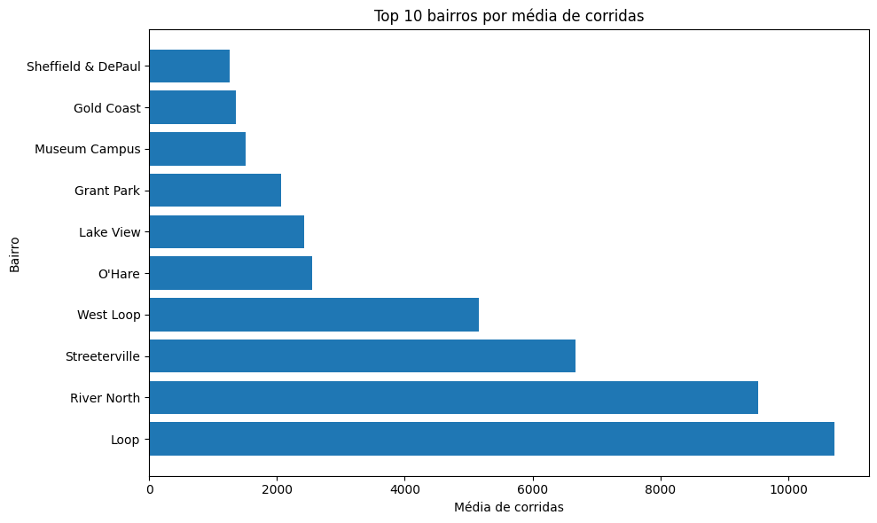

# Data Analytics Portfolio
### Luciana Jost | Marketing & Data Analytics

Marketing professional combining 10+ years of brand strategy and events experience with data analytics skills. Currently completing a Master's in Marketing Management at IPAM Lisboa and a Data Analyst certification at TripleTen.

---

## Skills
Python · Pandas · NumPy · Matplotlib · Seaborn · Statistical Analysis · Exploratory Data Analysis · Data Visualization

---

## Projects

### 🎮 Video Game Market Analysis
Exploratory data analysis of global video game sales to identify market patterns and support campaign planning decisions.

**Tools:** Python · Pandas · Matplotlib · Seaborn · SciPy

**Key topics:** Platform lifecycle · Regional consumer profiles · Hypothesis testing · Correlation analysis

> 📓 [View Notebook](notebook-6.ipynb) · 📊 [View Presentation](VideoGame_Analysis_LuJ_Portfolio.pdf)

---

### 🚕 Zuber Ride Analysis in Chicago
Exploratory data analysis and statistical hypothesis testing on ride-sharing data for Zuber, a fictional new ride-sharing company launching in Chicago. The project identifies the busiest taxi companies and destination neighborhoods, then tests whether weather conditions affect ride duration on trips between the Loop and O'Hare International Airport.

**Tools:** Python · Pandas · Matplotlib · SciPy · SQL

**Key topics:** Exploratory data analysis · Data visualization · Two-sample t-test · Hypothesis testing

**Key finding:** Rides between the Loop and O'Hare take significantly longer on rainy Saturdays than on clear ones (p ≈ 9.13 × 10⁻⁸), rejecting the null hypothesis that weather has no effect on ride duration.

> 📓 [View Notebook](zuber_chicago_ride_analysis.ipynb)

  
  

---

## Contact
[LinkedIn](https://linkedin.com/in/lucianajost) · lucianajostlj@gmail.com
