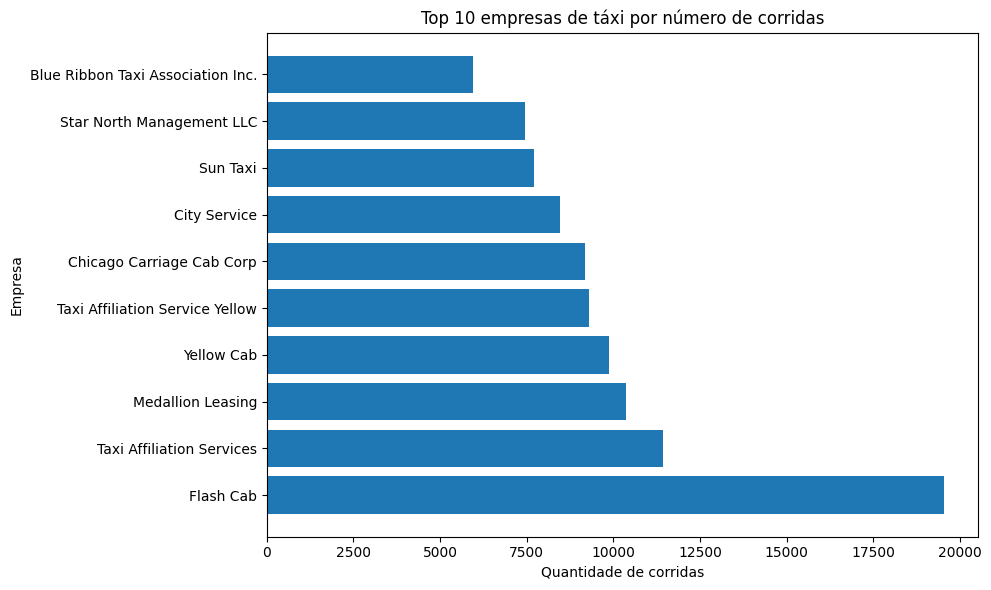
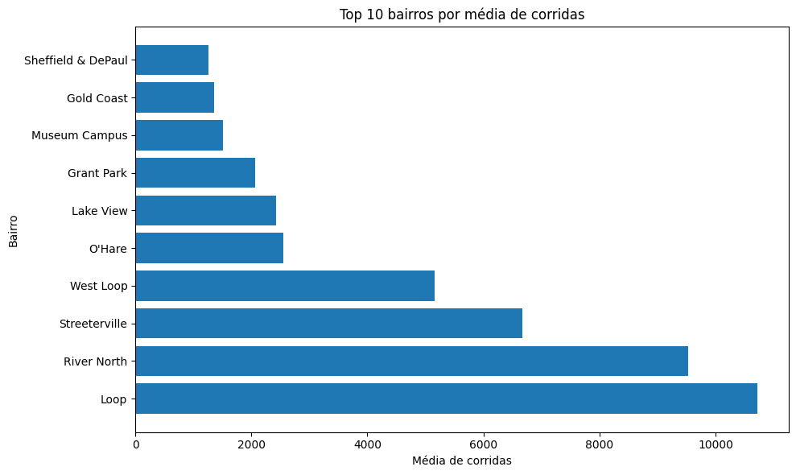

# Data Analytics Portfolio
### Luciana Jost | Business & Data Analytics

Business and data analyst with 10+ years of experience in marketing, brand strategy and events. Every project here starts with a business question and ends with a recommendation. Currently completing a Master's in Marketing Management at IPAM Lisboa and a Data Analyst certification at TripleTen.

---

## Skills
SQL · Python · Pandas · NumPy · Matplotlib · Seaborn · SciPy · Tableau · Statistical Analysis · A/B Testing · Cohort Analysis · Data Visualization

---

## Projects

### 🎮 Video Game Market Analysis
Exploratory data analysis of global video game sales to identify market patterns and support campaign planning decisions.

**Tools:** Python · Pandas · Matplotlib · Seaborn · SciPy

**Key topics:** Platform lifecycle · Regional consumer profiles · Hypothesis testing · Correlation analysis

> 📓 [View Notebook](video_game_market_analysis_EN.ipynb) · 📊 [View Presentation](VideoGame_Analysis_LuJ_Portfolio.pdf)  
> 🇧🇷 Notebook also in Portuguese: [video_game_market_analysis.ipynb](video_game_market_analysis.ipynb)

---

### 🚕 Zuber Ride Analysis in Chicago
Exploratory data analysis and statistical hypothesis testing on ride-sharing data for Zuber, a fictional new ride-sharing company launching in Chicago. The project identifies the busiest taxi companies and destination neighborhoods, then tests whether weather conditions affect ride duration on trips between the Loop and O'Hare International Airport.

**Tools:** Python · Pandas · Matplotlib · SciPy · SQL

**Key topics:** Exploratory data analysis · Data visualization · Two-sample t-test · Hypothesis testing

**Key finding:** Rides between the Loop and O'Hare take significantly longer on rainy Saturdays than on clear ones (p ≈ 9.13 × 10⁻⁸), rejecting the null hypothesis that weather has no effect on ride duration.

> 📓 [View Notebook](zuber_chicago_ride_analysis.ipynb) · 📊 [View Presentation](Zuber_Chicago_Analysis_EN_LuJost.pdf)  
> 🇧🇷 Presentation also in Portuguese: [Zuber_Chicago_Analysis_LuJ_Portfolio.pdf](Zuber_Chicago_Analysis_LuJ_Portfolio.pdf)

  
  

---

### 🎟️ Y.Afisha Business Analysis
Marketing efficiency and unit economics analysis for Y.Afisha, an entertainment ticketing platform, covering user behavior, cohort retention, and the relationship between acquisition cost and customer lifetime value.

**Tools:** Python · Pandas · NumPy · Matplotlib · Seaborn

**Key topics:** Cohort retention analysis · Conversion funnel · Customer acquisition cost (CAC) · Customer lifetime value (LTV) · ROMI

**Key finding:** No cohort fully recovered its acquisition cost within the observed window; average cumulative ROMI reached only 0.67 by month 11, and the median customer placed just one order, pointing to retention and repeat purchase as bigger levers than acquisition volume alone.

> 📓 [View Notebook](yafisha_business_analysis_EN.ipynb) · 📊 [View Presentation](YAfisha_Analysis_EN_LuJost.pdf)  
> 🇧🇷 Also in Portuguese: [notebook](yafisha_business_analysis.ipynb) · [presentation](YAfisha_Analysis_LuJ_Portfolio.pdf)

---

### ☕ LA Robot-Service Cafe Market Analysis
Market viability analysis for a robot-service cafe concept in Los Angeles, covering establishment types, chain versus independent structure, seat capacity benchmarks, and street-level location density across 9,650 restaurants.

**Tools:** Python · Pandas · Seaborn · Matplotlib

**Key topics:** Market segmentation · Chain structure analysis · Seat capacity benchmarking · Geographic density

**Key finding:** Cafes are the second most chain-dominant establishment type in the market (61.1%, after bakeries), and networks in the sample consistently favor compact units (25 to 30 seats) over large flagship locations, pointing to a repeatable, moderate-footprint format as the strongest entry strategy.

> 📓 [View Notebook](la_restaurant_market_analysis_EN.ipynb) · 📊 [View Presentation](LA_Cafeteria_Investor_Deck_EN_LuJost.pdf)  
> 🇧🇷 Also in Portuguese: [notebook](analise_mercado_restaurantes_LA.ipynb) · [presentation](LA_Cafeteria_Investor_Deck_Sprint10_PT_LuJost.pdf)

---

### 🧪 A/B Test Analysis & Hypothesis Prioritization
Business decision analysis for an online store, combining ICE/RICE prioritization of nine marketing hypotheses with a full statistical evaluation of an in-progress A/B test.

**Tools:** Python · Pandas · NumPy · SciPy · Matplotlib

**Key topics:** ICE and RICE scoring · A/B test data validation · Mann-Whitney U testing · Outlier-robust analysis

**Key finding:** After removing 58 users with cross-group contamination, group B showed a statistically significant conversion advantage over group A both in raw data (p ≈ 0.011) and after outlier removal (p ≈ 0.016), with no significant difference in average order value, supporting a decision to stop the test with group B as the winner.

> 📓 [View Notebook](ab_test_hypothesis_prioritization_EN.ipynb)  
> 🇧🇷 Notebook also in Portuguese: [ab_test_hypothesis_prioritization.ipynb](ab_test_hypothesis_prioritization.ipynb)

---

### 🛵 Food Delivery App: Funnel & A/A/B Font Test
Analysis of user behavior in a food delivery app, covering the full purchase funnel from the main screen to payment, and a statistical test of whether a font change affected conversion.

**Tools:** Python · Pandas · NumPy · Matplotlib · SciPy (statsmodels)

**Key topics:** Conversion funnel analysis · A/A/B testing · Two-proportion z-test · Bonferroni correction

**Key finding:** The font change had no statistically significant effect on any of the 20 test comparisons, even before correcting for multiple testing; the real opportunity is the ~38% drop-off between the main screen and the offers screen.

> 📓 [View Notebook](food_delivery_funnel_ab_test.ipynb) · 📊 [View Presentation](Food_Delivery_Funnel_AAB_Test_LuJ_Portfolio.pdf)

---

### 📺 YouTube Trending Videos Dashboard (Tableau)
Interactive dashboard for a video advertising team, showing which categories and countries dominate YouTube trending videos, based on 339,990 records across 5 countries (November 2017 to June 2018).

**Tools:** Tableau Public

**Key topics:** Dashboard design · Interactive filters · Category and regional analysis · Data storytelling

**Key finding:** Entertainment accounts for 27.9% of all trending videos, more than double the second category. In the US, Music and Howto & Style weigh about twice as much as in other markets. The jump in total daily volume in February 2018 came from Japan entering the dataset, not from real growth.

> 📊 [View Dashboard](https://public.tableau.com/views/YouTubeTrendingDashboard_17908531142200/Painel1) · 📑 [View Presentation](YouTube_Trending_Dashboard_EN_LuJost.pdf) · 📁 [Data (CSV)](youtube_trending_by_time.csv)  
> 🇧🇷 Presentation also in Portuguese: [YouTube_Trending_Dashboard_PT_LuJost.pdf](YouTube_Trending_Dashboard_PT_LuJost.pdf)

---

## Contact
[LinkedIn](https://www.linkedin.com/in/lujost) · lucianajostlj@gmail.com
